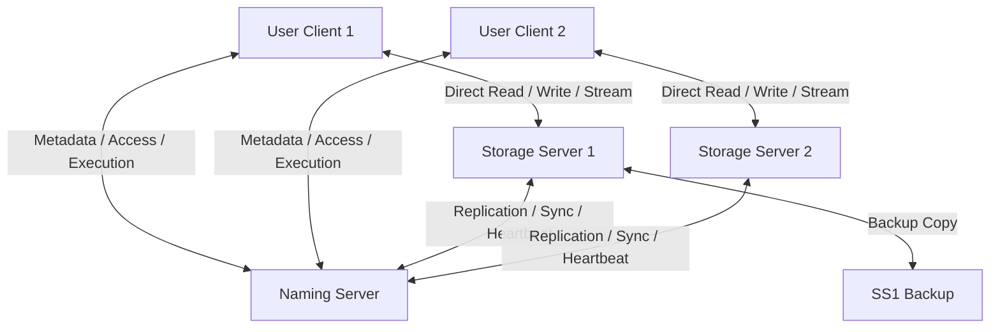

# Distributed File System

Welcome to the **Distributed File System**, a robust, high-performance Network File System built in C from the ground up. This system is designed for concurrent, sentence-level document editing and collaboration with enterprise-grade features including role-based access control, transaction undo/checkpointing, hierarchical folder structures, remote shell execution, and automated fault tolerance/replication.

---

## 🛠️ System Architecture

The NFS is split into three core components, coordinating via custom TCP protocol packets:



### 1. Naming Server (NM)
*   **Central Coordinator:** Acts as the entry point and registry.
*   **O(1) Filename Lookup:** Uses a custom **djb2 Hash Map** and a **Least-Recently-Used (LRU) Cache** to resolve file-to-server slots in constant time.
*   **Access Control Registry:** Enforces permissions, maintains access lists, and tracks pending request queues.
*   **Remote Execution Engine:** Executes script files directly on the NM server and pipes the output stream back to the client.

### 2. Storage Server (SS)
*   **Persistence & Metadata Storage:** Files and permissions are stored locally in the server's storage path.
*   **Sentence-Level Linked List Engine:** Parsers build memory structures where files are represented as linked lists of sentences, which in turn contain linked lists of words. This enables granular locking and dynamic sentence segmentation (recognizing `.`, `!`, `?` delimiters in real-time).
*   **Fine-Grained Locking:** Lock sessions restrict concurrent editing to individual sentences, rather than locking entire files.
*   **Transaction Logging & Checkpoints:** Maintains backups for quick Undo triggers and allows tagged checkpoint creation, reversion, and history logging.

### 3. User Client
*   **Interactive Command Shell:** Provides a clean interface for executing file operations.
*   **Direct-to-Storage Transfer:** Receives Storage Server IP/Port coordinates from the Naming Server and opens direct connections to the target Storage Server for high-performance reading, writing, and streaming.

---

## Repository Structure

*   [`client/`](file:///c:/Users/Asus/Documents/repos/Distributed-File-System/client): Source code for the interactive User Client app (`client.c`).
*   [`name/`](file:///c:/Users/Asus/Documents/repos/Distributed-File-System/name): Source code for the central Naming Server coordinator (`name_server.c`).
*   [`storage/`](file:///c:/Users/Asus/Documents/repos/Distributed-File-System/storage): Source code for the Storage Server daemon (`storage_server.c`).
*   [`protocol/`](file:///c:/Users/Asus/Documents/repos/Distributed-File-System/protocol): Common message headers, packet structs, and communication types (`protocol.h`).
*   [`ss_storage/`](file:///c:/Users/Asus/Documents/repos/Distributed-File-System/ss_storage): Sandbox folder where storage files, metadata files, and checkpoints are stored locally.

---

## Getting Started

### Prerequisites
Ensure you have `gcc` and `make` installed on your system. This system is designed for Linux-based/POSIX socket interfaces (WSL is fully supported on Windows).

### Compilation
Build all components (Client, Name Server, and Storage Server) using the provided `Makefile`:

```bash
make clean
make all
```

This compiles the code and places the executables in the root directory:
*   `name_server`
*   `storage_server`
*   `client_app`

---

## Running the System

For local multi-server setups, spin up each process in separate terminal windows.

### 1. Start the Name Server
The Name Server listens on port `8080` by default.
```bash
./name_server
```

### 2. Start Storage Servers (SS)
Spin up one or more Storage Servers. You can configure individual storage directories and client ports.
```bash
# Syntax: ./storage_server [client_port] [storage_path] [client_ip] [nm_ip]
./storage_server 8082 ./ss_storage 127.0.0.1 127.0.0.1
```

### 3. Start the User Client
Start the client application by providing the IP address of the Naming Server.
```bash
# Syntax: ./client_app [nm_ip]
./client_app 127.0.0.1
```
Upon startup, the client will prompt you to enter your username.

---

## Client Command Reference

| Command | Action | Description |
| :--- | :--- | :--- |
| **`VIEW`** | View accessible files | Lists all files the current user has access to. |
| **`VIEW -a`** | View all files | Lists all files present in the system, regardless of permissions. |
| **`VIEW -l`** | View accessible with details | Displays details like filename, owner, size (bytes), word/char counts, and last accessed time. |
| **`VIEW -al`** | View all with details | Displays all files on the system with detailed metadata. |
| **`CREATE <filename>`** | Create a file | Creates an empty text file on an available storage server. |
| **`READ <filename>`** | Read file contents | Prints the full content of the file. |
| **`WRITE <filename> <sentence_num>`**| Edit a sentence | Locks the sentence and opens the interactive write shell. |
| **`UNDO <filename>`** | Revert last change | Reverts the file to its previous state (or toggles checkpoints if applicable). |
| **`STREAM <filename>`** | Stream file contents | Direct connection download displaying the file word-by-word with a 0.1s delay. |
| **`INFO <filename>`** | Display file metadata | Shows ownership, permissions, word/char counts, and modification/access timestamps. |
| **`DELETE <filename>`** | Delete file | Deletes the file, its backup, and cleans up access metadata. |
| **`LIST`** | List users | Lists all registered users in the network database. |
| **`EXEC <filename>`** | Shell execute file | Runs file contents as bash/shell commands on the NM, returning piped output. |

### 🗂️ Folder Operations (Bonus)
*   **`CREATEFOLDER <foldername>`**: Creates a directory on the storage server.
*   **`MOVE <filename> <foldername>`**: Moves a file into the specified directory path.
*   **`VIEWFOLDER <foldername>`**: Lists all files stored inside the folder.

### 📝 Access Control Commands
*   **`ADDACCESS -R <filename> <username>`**: Adds Read-Only permission.
*   **`ADDACCESS -W <filename> <username>`**: Adds Read-Write permission.
*   **`REMACCESS <filename> <username>`**: Removes all access permissions for the user.
*   **`REQACCESS -R\|-W <filename>`**: Requests read or write access from the owner.
*   **`CHECKREQUESTS`**: Owner command to view the queue of access requests and approve/deny them.

### 💾 Checkpoints (Bonus)
*   **`CHECKPOINT <filename> <tag>`**: Saves the file state with a specific tag identifier.
*   **`VIEWCHECKPOINT <filename> <tag>`**: Views the content of the checkpoint.
*   **`REVERT <filename> <tag>`**: Reverts the active file content to the checkpoint.
*   **`LISTCHECKPOINTS <filename>`**: Lists all checkpoint tags and their creation times.

---

## Write Session & Sentence Locking Flow

Editing is performed at the sentence level rather than locking the entire file. The workflow is as follows:
1.  **Request Lock:** Execute `WRITE <filename> <sentence_num>`.
2.  **Acquire Lock:** The Storage Server verifies sentence existence, checks that no other user is editing, and locks the sentence node in memory.
3.  **Perform Edits:** Provide updates inside the edit shell:
    *   **Syntax:** `<word_index> <content>` (Updates the sentence at the word index with content).
    *   If you include delimiters (e.g. `.`, `?`, `!`), the linked-list parser splits the sentence and updates indexes dynamically.
4.  **Save Changes:** Type `ETIRW` to commit the operations, write changes to storage, and release the lock.

---

## Key System Implementations & Rules

> **Metadata Access Control:**
> Viewing file metadata (`INFO`) does not require write access, allowing users to coordinate ownership transparently.
> Other users can access the subdirectories made by other users, facilitating open collaboration.

> **Transaction Undo Mechanics:**
> If a file transitions from state `A` to state `B`, running `UNDO` reverts it back to `A`. Running `UNDO` again toggles it back to `B` (restoring the last pre-undo state). 
> The system supports single-operation undo/redo toggling, stored reliably at the storage server level.

> **Fast Lookups & LRU Caching:**
> Search algorithms utilize a **djb2 hash mapping** technique to index file locations. An **LRU Cache** of size 5 is maintained for file queries. Frequent lookups result in a cache hit, reducing lookup overhead.

> **Name Server Failure:**
> The Name Server acts as the central coordinator. If the Name Server goes down, the entire system is considered down and must be restarted. Storage Server failures are, however, handled gracefully via replication.
